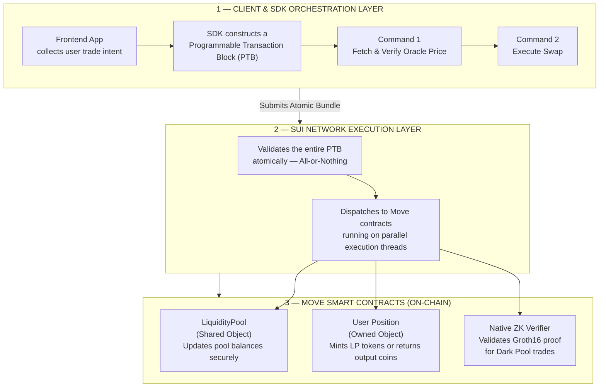

# Sui Dark Pool — ZK-Protected DEX Architecture

A research & reference implementation demonstrating how to build a **MEV-resistant, privacy-preserving decentralized exchange** on the [Sui blockchain](https://sui.io), combining Sui's object model, Programmable Transaction Blocks (PTBs), and ZK-SNARK proofs.

---

## Table of Contents

- [Architecture](#architecture)
  - [1. Client & SDK Orchestration Layer](#1-client--sdk-orchestration-layer)
  - [2. Sui Network Execution Layer](#2-sui-network-execution-layer)
  - [3. Move Smart Contracts (On-Chain)](#3-move-smart-contracts-on-chain)
- [ZK-SNARK Pipeline](#zk-snark-pipeline)
  - [Circuit](#circuit)
  - [Running the Pipeline](#running-the-pipeline)
- [Repository Structure](#repository-structure)

---

## Architecture

The protocol is structured as three cooperating layers. Each layer has a well-defined responsibility, and together they guarantee atomicity, parallel execution, and trade privacy.



---

### 1. Client & SDK Orchestration Layer

The frontend collects the user's trade intent (token pair, amount, slippage tolerance). The Sui TypeScript SDK then assembles a **Programmable Transaction Block (PTB)** — a composable bundle of commands executed as a single atomic unit:

| Command | Description |
|---|---|
| `Command 1` | Fetch the latest price from an on-chain oracle and verify it is within the acceptable slippage range |
| `Command 2` | Execute the swap against the `LiquidityPool` shared object |

If the oracle price check fails, the entire PTB is reverted — no state is changed and no fees are charged for the failed commands.

---

### 2. Sui Network Execution Layer

Sui's validator network processes the PTB with **all-or-nothing atomicity**. Because Sui's object model distinguishes between shared and owned objects, transactions that do not contend for the same shared state are executed in **parallel**, giving the protocol high throughput without sacrificing safety.

---

### 3. Move Smart Contracts (On-Chain)

| Contract | Object Type | Responsibility |
|---|---|---|
| `LiquidityPool` | Shared Object | Holds pool reserves; updated by every swap |
| `UserPosition` | Owned Object | Mints LP tokens or returns output coins to the trader |
| `ZkVerifier` | Shared Object | Verifies a Groth16 / BN254 proof before allowing a Dark Pool trade |

Separating **Shared** and **Owned** objects is the key architectural decision that enables parallel execution. Owned object transactions never contend with each other and are processed without consensus overhead.

---

## ZK-SNARK Pipeline

Dark Pool trades hide trade size and intent by submitting a ZK proof instead of raw inputs. The proof is generated off-chain and verified on-chain by the `ZkVerifier` contract.

### Circuit — `DarkPoolSwap`

[`circ.circom`](./circ.circom) implements a production-grade **Groth16 circuit over BN254**, instantiated as `DarkPoolSwap(20, 64)`.

In a single proof it simultaneously proves **6 constraints**:

| # | Constraint | What it proves |
|---|---|---|
| 1 | **AMM Invariant** | The swap satisfies `(reserve_x · fee_den + Δx · fee_num) · (reserve_y − Δy) ≥ reserve_x · reserve_y · fee_den` — the constant-product formula with fee, without revealing any amount |
| 2 | **Slippage Guard** | `Δy ≥ min_output` — trader's minimum is met, preventing sandwich attacks |
| 3 | **Range Checks** | All amounts `Δx, Δy, reserve_x, reserve_y` fit in 64 bits — prevents overflow and negative-number exploits |
| 4 | **Input Commitment** | `Poseidon(secret, salt) == input_commitment` — trader owns the input without revealing it |
| 5 | **Nullifier** | `Poseidon(secret) == nullifier_hash` — posted on-chain to prevent double-spending the same commitment |
| 6 | **Merkle Inclusion** | `Poseidon(reserve_x, reserve_y)` is a leaf in the pool state Merkle tree (depth 20, ~1M leaves) — proves the reserves used are genuine |

#### Signal interface

```
Public  → pool_state_root, input_commitment, nullifier_hash, min_output, fee_num, fee_den
Private → reserve_x, reserve_y, delta_x, delta_y, trader_secret, trader_salt,
          merkle_path[20], merkle_indices[20]
Output  → out_nullifier
```

#### Sample inputs ([`input.json`](./input.json))

```json
{
    "pool_state_root":  "12345678901234567890",
    "input_commitment": "9876543210987654321",
    "nullifier_hash":   "1122334455667788990",
    "min_output":       "9",
    "fee_num":          "997",
    "fee_den":          "1000",
    "reserve_x":        "1000000",
    "reserve_y":        "1000000",
    "delta_x":          "1000",
    "delta_y":          "996",
    "trader_secret":    "42",
    "trader_salt":      "99",
    "merkle_path":      ["0","0","0","0","0","0","0","0","0","0","0","0","0","0","0","0","0","0","0","0"],
    "merkle_indices":   ["0","0","0","0","0","0","0","0","0","0","0","0","0","0","0","0","0","0","0","0"]
}
```

### Running the Pipeline

The full ZK-SNARK pipeline (compile → witness → trusted setup → prove → verify) is automated. Choose the script that matches your environment.

**Linux / macOS**

```bash
chmod +x run_zk.sh
./run_zk.sh
```

**Windows (PowerShell)**

```powershell
.\run_zk.ps1
```

#### What the script does

| Step | Tool | Output |
|---|---|---|
| 1. Compile circuit | `circom` | `circ.r1cs`, `circ.wasm` |
| 2. Generate witness | `snarkjs` / Node | `witness.wtns` |
| 3. Powers of Tau (Phase 1) | `snarkjs powersoftau` | `pot12_final.ptau` |
| 4. Circuit setup (Phase 2) | `snarkjs groth16 setup` | `circ_final.zkey` |
| 5. Export verification key | `snarkjs zkey export` | `verification_key.json` |
| 6. Generate proof | `snarkjs groth16 prove` | `proof.json`, `public.json` |
| 7. Verify proof | `snarkjs groth16 verify` | ✓ / ✗ |

**Prerequisites:** Node.js, `circom` CLI, `snarkjs` (install globally with `npm i -g snarkjs`).

---

## Repository Structure

```
.
├── circ.circom          # ZK circuit (Circom 2.0, Groth16 / BN254)
├── input.json           # Public inputs for the circuit
├── run_zk.sh            # ZK pipeline automation script (Linux/macOS)
├── run_zk.ps1           # ZK pipeline automation script (Windows)
└── README.md            # This document
```
