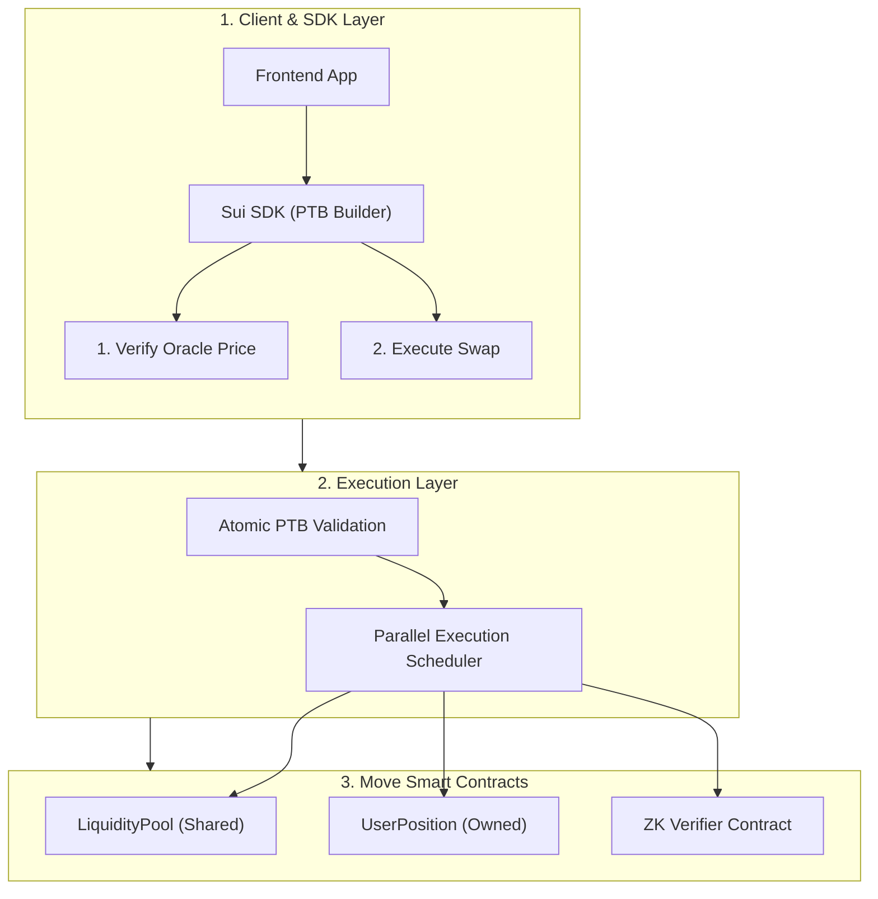

# Dark Pool DEX Architecture on Sui

System design and architecture specification for a MEV-resistant, private decentralized exchange on Sui.

## Overview

Public AMMs face two main issues:
1. **MEV & Front-running:** Public mempools allow sandwich attacks.
2. **State Contention:** Global pool updates block parallel execution.

This design solves both using:
- **Move Object Model:** Owned objects for user positions (parallel path), Shared objects for liquidity pools.
- **Programmable Transaction Blocks (PTB):** Bundles price verification, swaps, and slippage checks into an atomic unit.
- **ZK Dark Pool Layer:** Validates order parameters off-chain using ZK proofs.

---

## Architecture

---

## Components

### 1. Client & SDK Layer
Builds Programmable Transaction Blocks (PTBs):
- Enforces price and slippage checks before swap execution.
- If any check fails, the entire transaction block reverts.

### 2. Sui Network Execution Layer

| Object Type | Role | Consensus |
|---|---|---|
| **Shared Objects** | Pools & Orderbook | Full Consensus |
| **Owned Objects** | User Positions & Tokens | Parallel Fast Path |

### 3. ZK Proof Engine Specifications

Off-chain prover verifies 6 constraints:
1. **AMM Invariant:** `(x · fee_den + Δx · fee_num)(y − Δy) ≥ xy · fee_den`
2. **Slippage Guard:** `Δy ≥ min_output`
3. **Pool Solvency:** `y > Δy`
4. **Commitment:** `Poseidon(secret, salt) == input_commitment`
5. **Nullifier:** `Poseidon(secret) == nullifier_hash`
6. **Merkle Inclusion:** `MerkleRoot(Poseidon(x, y)) == pool_state_root` (depth 20)

---

## Execution Flow

1. Trader computes proof off-chain.
2. Client packages proof and PTB commands.
3. Network verifies proof, updates pool state, and outputs tokens to user position.
