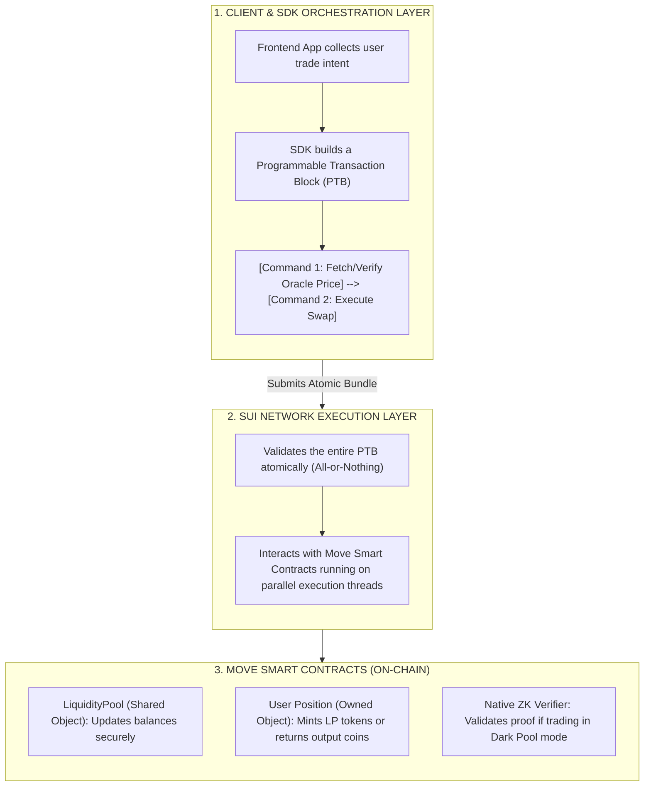

# Protocol Architecture Overview

## System Flow

```mermaid
flowchart TD
    subgraph L1 ["1. CLIENT & SDK ORCHESTRATION LAYER"]
        direction TB
        A["Frontend App collects user trade intent"]
        B["SDK builds a Programmable Transaction Block (PTB)"]
        C["[Command 1: Fetch/Verify Oracle Price] --> [Command 2: Execute Swap]"]
        
        A --> B
        B --> C
    end

    subgraph L2 ["2. SUI NETWORK EXECUTION LAYER"]
        direction TB
        D["Validates the entire PTB atomically (All-or-Nothing)"]
        E["Interacts with Move Smart Contracts running on parallel execution threads"]
        
        D --> E
    end

    subgraph L3 ["3. MOVE SMART CONTRACTS (ON-CHAIN)"]
        direction TB
        F["LiquidityPool (Shared Object): Updates balances securely"]
        G["User Position (Owned Object): Mints LP tokens or returns output coins"]
        H["Native ZK Verifier: Validates proof if trading in Dark Pool mode"]
    end

    L1 -- "Submits Atomic Bundle" --> L2
    L2 --> L3
```
