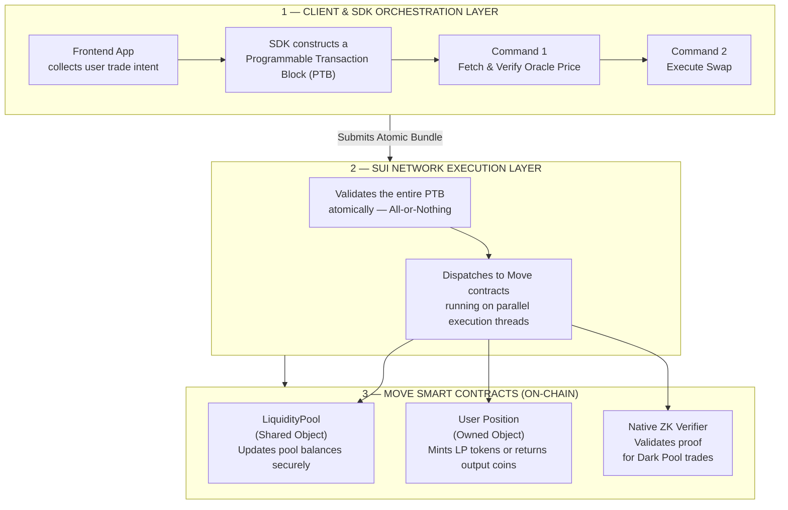

# Sui Dark Pool — ZK-Protected DEX Architecture

A research & reference implementation demonstrating how to build a **MEV-resistant, privacy-preserving decentralized exchange** on the [Sui blockchain](https://sui.io), combining Sui's object model, Programmable Transaction Blocks (PTBs), and zero-knowledge proofs built with [Noir](https://noir-lang.org/).

---

## Table of Contents

- [Architecture](#architecture)
  - [1. Client & SDK Orchestration Layer](#1-client--sdk-orchestration-layer)
  - [2. Sui Network Execution Layer](#2-sui-network-execution-layer)
  - [3. Move Smart Contracts (On-Chain)](#3-move-smart-contracts-on-chain)
- [Noir ZK Pipeline](#noir-zk-pipeline)
  - [Circuit Structure](#circuit-structure)
  - [Running the Pipeline](#running-the-pipeline)
- [Repository Structure](#repository-structure)

---

## Architecture

The protocol is structured as three cooperating layers. Each layer has a well-defined responsibility, and together they guarantee atomicity, parallel execution, and trade privacy.



---

### 1. Client & SDK Orchestration Layer

The frontend collects the user's trade intent (token pair, amount, slippage tolerance). The Sui TypeScript SDK then assembles a **Programmable Transaction Block (PTB)** — a composable bundle of commands executed as a single atomic unit:

| Command | Description |
|---|---|
| `Command 1` | Fetch the latest price from an on-chain oracle and verify it is within the acceptable slippage range |
| `Command 2` | Execute the swap against the `LiquidityPool` shared object |

If the oracle price check fails, the entire PTB is reverted — no state is changed and no fees are charged for the failed commands.

---

### 2. Sui Network Execution Layer

Sui's validator network processes the PTB with **all-or-nothing atomicity**. Because Sui's object model distinguishes between shared and owned objects, transactions that do not contend for the same shared state are executed in **parallel**, giving the protocol high throughput without sacrificing safety.

---

### 3. Move Smart Contracts (On-Chain)

| Contract | Object Type | Responsibility |
|---|---|---|
| `LiquidityPool` | Shared Object | Holds pool reserves; updated by every swap |
| `UserPosition` | Owned Object | Mints LP tokens or returns output coins to the trader |
| `ZkVerifier` | Shared Object | Verifies ZK proof before allowing a Dark Pool trade |

Separating **Shared** and **Owned** objects is the key architectural decision that enables parallel execution. Owned object transactions never contend with each other and are processed without consensus overhead.

---

## Noir ZK Pipeline

Dark Pool trades hide trade size and intent by submitting a zero-knowledge proof generated off-chain. The circuit is written in [Noir](https://noir-lang.org/) (`.nr`), a Rust-like DSL for ZK circuits.

### Circuit Structure — `src/main.nr`

The Noir circuit [`src/main.nr`](./src/main.nr) simultaneously proves **6 core constraints**:

| # | Constraint | What it proves |
|---|---|---|
| 1 | **AMM Invariant** | `(reserve_x · fee_den + Δx · fee_num) · (reserve_y − Δy) ≥ reserve_x · reserve_y · fee_den` — constant-product formula with fee |
| 2 | **Slippage Guard** | `Δy ≥ min_output` — enforces trader's minimum received amount |
| 3 | **Pool Drainage** | `reserve_y > Δy` — prevents pool depletion |
| 4 | **Commitment Verification** | `Poseidon(secret, salt) == input_commitment` — proves trader ownership |
| 5 | **Nullifier Derivation** | `Poseidon(secret) == nullifier_hash` — prevents double-spending |
| 6 | **Merkle Inclusion Proof** | `MerkleRoot(Poseidon(reserve_x, reserve_y)) == pool_state_root` — proves pool reserves are genuine (depth 20) |

#### Noir Code ([`src/main.nr`](./src/main.nr))

```rust
use dep::std;

fn main(
    // Public inputs
    pool_state_root: pub Field,
    input_commitment: pub Field,
    nullifier_hash: pub Field,
    min_output: pub Field,
    fee_num: pub Field,
    fee_den: pub Field,

    // Private inputs
    reserve_x: Field,
    reserve_y: Field,
    delta_x: Field,
    delta_y: Field,
    trader_secret: Field,
    trader_salt: Field,
    merkle_path: [Field; 20],
    merkle_indices: [u1; 20]
) {
    let lhs_a = reserve_x * fee_den + delta_x * fee_num;
    let net_y = reserve_y - delta_y;
    let lhs = lhs_a * net_y;
    let rhs = reserve_x * reserve_y * fee_den;
    assert(lhs >= rhs, "AMM invariant violation");

    assert(delta_y >= min_output, "Slippage tolerance exceeded");
    assert(reserve_y > delta_y, "Insufficient liquidity in pool");

    let computed_commitment = std::hash::poseidon::bn254::hash_2([trader_secret, trader_salt]);
    assert(input_commitment == computed_commitment, "Invalid commitment proof");

    let computed_nullifier = std::hash::poseidon::bn254::hash_1([trader_secret]);
    assert(nullifier_hash == computed_nullifier, "Invalid nullifier proof");

    let leaf = std::hash::poseidon::bn254::hash_2([reserve_x, reserve_y]);
    let computed_root = std::merkle::compute_merkle_root(leaf, merkle_indices, merkle_path);
    assert(pool_state_root == computed_root, "Pool state Merkle proof verification failed");
}
```

---

### Running the Pipeline

**Linux / macOS**

```bash
chmod +x run_noir.sh
./run_noir.sh
```

**Windows (PowerShell)**

```powershell
.\run_noir.ps1
```

#### Nargo & Barretenberg Commands

| Step | Tool | Command |
|---|---|---|
| 1. Check circuit | `nargo` | `nargo check` |
| 2. Execute witness | `nargo` | `nargo execute witness` |
| 3. Generate proof | `bb` | `bb prove -b ./target/dark_pool.json -w ./target/witness.gz -o ./target/proof` |
| 4. Verify proof | `bb` | `bb verify -p ./target/proof -k ./target/vk` |

---

## Repository Structure

```
.
├── Nargo.toml           # Noir package manifest
├── Prover.toml          # Input parameters for proving/execution
├── src/
│   └── main.nr          # Noir ZK circuit
├── run_noir.sh          # Pipeline script (Linux/macOS)
├── run_noir.ps1         # Pipeline script (Windows)
└── README.md            # Documentation
```
